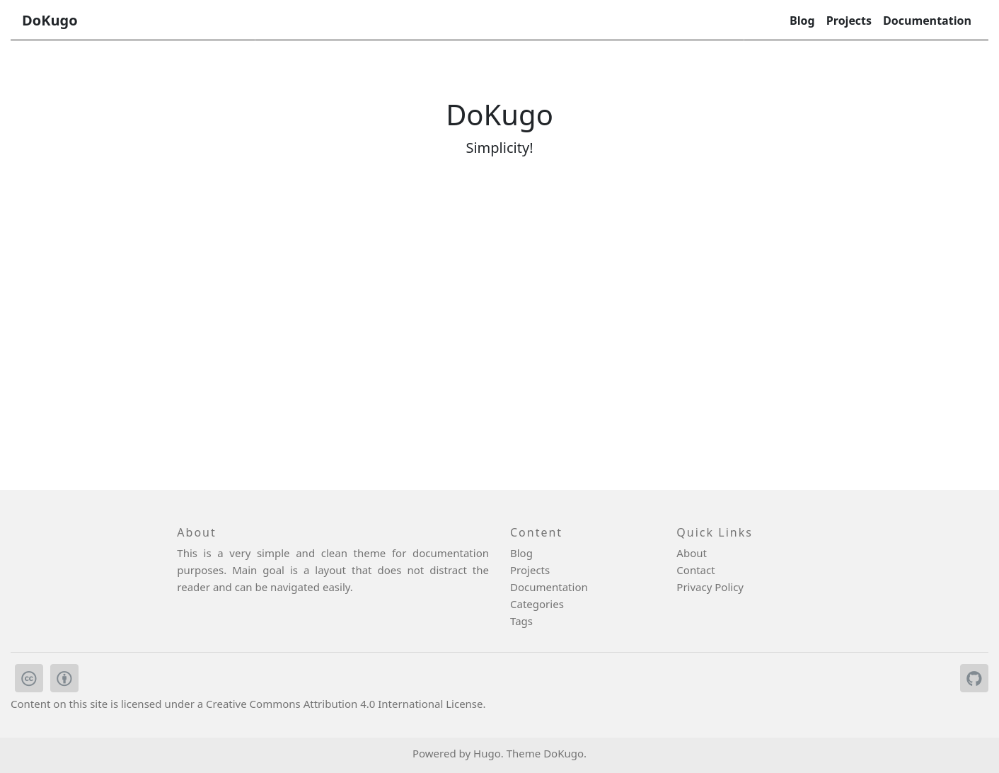

A simple theme for technical documentation purposes.



## Features

- LaTeX with MathJax
- Mermaid - generation of diagrams and flowcharts
- Breadcrumbs
- Table of Contents for articles

## Preview Theme with `exampleSite` Content

If you want to test this theme just clone this repository with

```bash
git clone git@github.com:akutschi/dokugo.git
```

and then

```bash
cd exampleSite
hugo server --themesDir ../../
```

Browse site on http://localhost:1313.
Or just visit https://akutschi.github.io/dokugo.

## Quick Start

### Requirement

Hugo minimum version: `0.69`

### Download

Assuming that you created a new site with `hugo new site <sitename>` and `git` is installed. 
We simply clone this repository into your themes folder:

```bash
hugo new site <sitename>
cd <sitename>
git init
git submodule add git@github.com:akutschi/dokugo.git themes/dokugo
```

Now we have created a new Hugo site, initialized a git repository and added the theme to our site.

For more information read [the Hugo documentation](https://gohugo.io/getting-started/quick-start/).

### Configure

You may specify options in your config file `config.toml` or `config.yaml`/`config.json` of your site to make use of this theme's features. 
At least choose this theme in your config file.

```bash
theme: "dokugo"
```

An example of a config file can be found in the `exampleSite` directory. 
Just copy the content or even the whole file into the root directory of your site.

## Documentation

The documentation can be found on the [demo site](https://akutschi.github.io/dokugo/documentation/dokugo/) or  [here](http://localhost:1313/dokugo/documentation/dokugo/) when you are running the `exampleSite` with the command above.
## Contributions 

Problems? Feature requests? Improvements? 

Probably, since this theme is currently optimized for my own personal use.
Nevertheless, feel free to open tickets for issues or merge requests. 
I am willing to discuss and consider every request. 
Thank you.

## License

DoKugo is licensed under the [GPLv3 license](https://github.com/akutschi/dokugo/blob/master/LICENSE).

## Author

[akutschi](https://github.com/akutschi)

Copyright (c) 2021 akutschi

